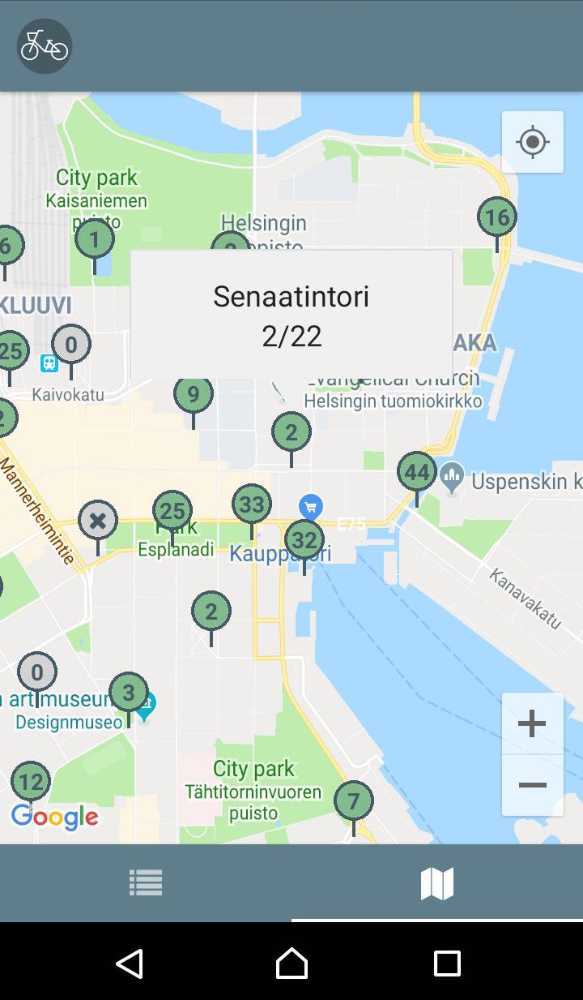

# Tsygä

Tsygä is a React Native (iOS + Android) application which tracks city bikes in Helsinki.
It allows users to mark their favorite/frequently used stations, showing those at
the top of the list. It displays the reservation status of each station as well as
distances to the stations, both on a list and on a map.

  
  

  
  

