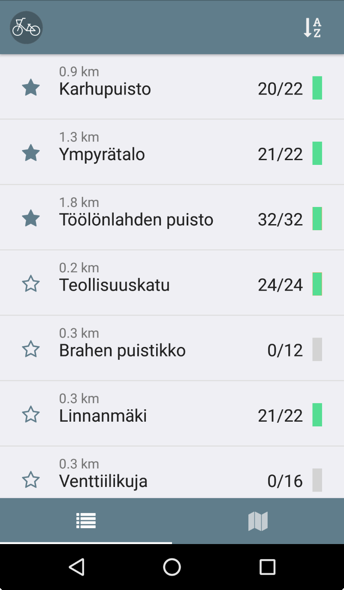

# Tsygä

Tsygä is a React Native (iOS + Android) application which tracks city bikes in Helsinki. 
It allows users to mark their favorite/frequently used stations, showing those at
the top of the list. It displays the reservation status of each station as well as 
distances to the stations, both on a list and on a map.

Android list               | Android map
:-------------------------:|:-------------------------:
  |  

iOS list                   | iOS map
:-------------------------:|:-------------------------:
  |  